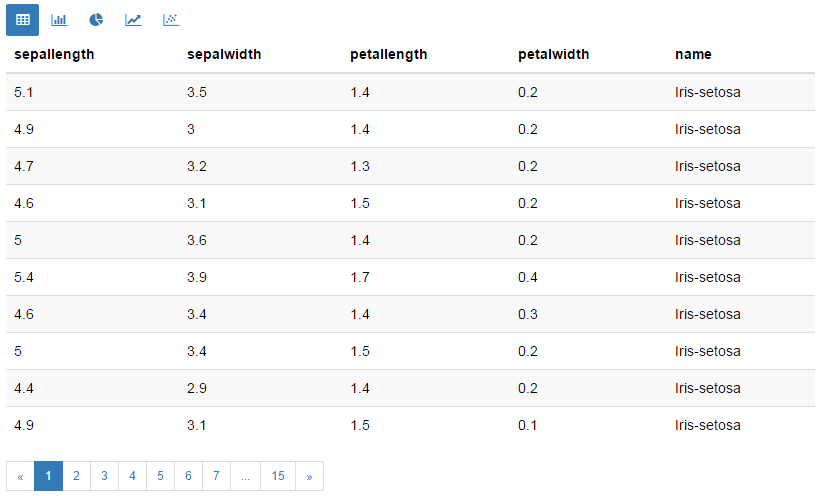
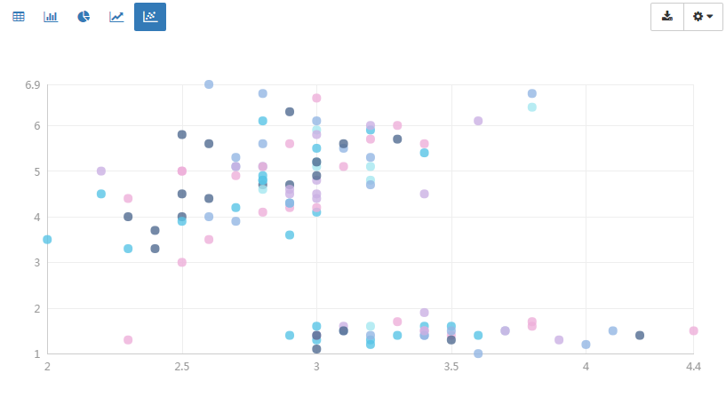
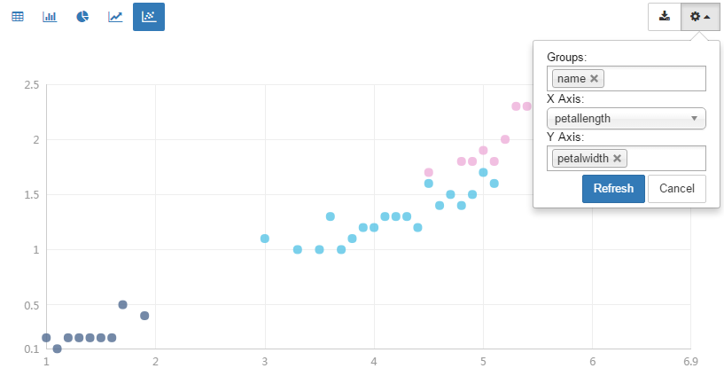
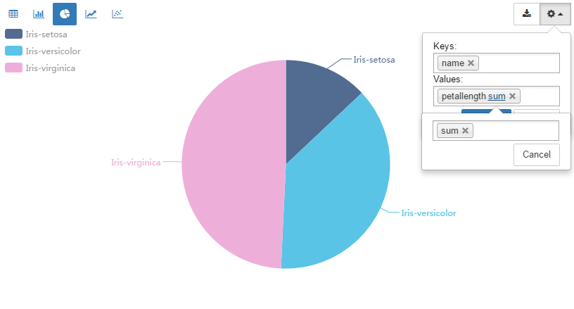
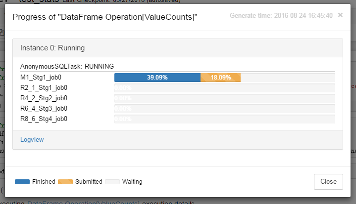

交互体验增强
============

命令行增强
----------

PyODPS
提供了命令行下的增强工具。首先，用户可以在任何地方配置了帐号以后，下次就无需再次输入帐号信息。

``` {.sourceCode .python}
from odps.inter import setup, enter, teardown
```

接着就可以配置帐号

``` {.sourceCode .python}
setup('**your-access_id**', '**your-access-key**', '**your-project**', endpoint='**your-endpoint**')
```

在不指定`room`这个参数时，会被配置到叫做`default`的room里。

以后，在任何命令行打开的地方，都可以直接调用：

``` {.sourceCode .python}
room = enter()
```

我们可以拿到ODPS的入口：

``` {.sourceCode .python}
o = room.odps
```

``` {.sourceCode .python}
o.get_table('dual')
```

<div class="admonition note">

**注意**：在重新 setup room 后，ODPS
入口对象并不会自动替换，需要再次调用 enter() 以获得新的 Room 对象。

</div>

我们可以把常用的ODPS表或者资源都可以存放在room里。

``` {.sourceCode .python}
room.store('存储表示例', o.get_table('dual'), desc='简单的表存储示例')
```

我们可以调用`display`方法，来把已经存储的对象以表格的形式打印出来：

``` {.sourceCode .python}
room.display()
```

<div style='padding-bottom: 30px'>
<table border="1" class="dataframe">
  <thead>
    <tr style="text-align: right;">
      <th>default</th>
      <th>desc</th>
    </tr>
    <tr>
      <th>name</th>
      <th></th>
    </tr>
  </thead>
  <tbody>
    <tr>
      <th>存储表示例</th>
      <td>简单的表存储示例</td>
    </tr>
    <tr>
      <th>iris</th>
      <td>安德森鸢尾花卉数据集</td>
    </tr>
  </tbody>
</table>
</div>
我们通过`room['存储表示例']`，或者像`room.iris`，就可以取出来存储的对象了。

``` {.sourceCode .python}
room['存储表示例']
```

删除也很容易，只需要调用drop方法

``` {.sourceCode .python}
room.drop('存储表示例')
```

``` {.sourceCode .python}
room.display()
```

<div style='padding-bottom: 30px'>
<table border="1" class="dataframe">
  <thead>
    <tr style="text-align: right;">
      <th>default</th>
      <th>desc</th>
    </tr>
    <tr>
      <th>name</th>
      <th></th>
    </tr>
  </thead>
  <tbody>
    <tr>
      <th>iris</th>
      <td>安德森鸢尾花卉数据集</td>
    </tr>
  </tbody>
</table>
</div>
要删除某个room，只需要调用teardown就可以了，不传参数时删除默认room。

    teardown()

IPython增强
-----------

PyODPS 还提供了 IPython 的插件，来更方便得操作 ODPS。

首先，针对命令行增强，也有相应的命令。让我们先加载插件：

``` {.sourceCode .python}
%load_ext odps
```

``` {.sourceCode .python}
%enter
```

此时全局会包含o和odps变量，即ODPS入口。

``` {.sourceCode .python}
o.get_table('dual')
odps.get_table('dual')
```

``` {.sourceCode .python}
%stores
```

<div style='padding-bottom: 30px'>
<table border="1" class="dataframe">
  <thead>
    <tr style="text-align: right;">
      <th>default</th>
      <th>desc</th>
    </tr>
    <tr>
      <th>name</th>
      <th></th>
    </tr>
  </thead>
  <tbody>
    <tr>
      <th>iris</th>
      <td>安德森鸢尾花卉数据集</td>
    </tr>
  </tbody>
</table>
</div>
### 对象名补全

PyODPS 拓展了 IPython 原有的代码补全功能，支持在书写 `o.get_xxx`
这样的语句时，自动补全对象名。

例如，在 IPython
中输入下列语句（&lt;tab&gt;不是实际输入的字符，而是当所有输入完成后，将光标移动到相应位置，
并按 Tab 键）：

``` {.sourceCode .python}
o.get_table(<tab>
```

如果已知需要补全对象的前缀，也可以使用

``` {.sourceCode .python}
o.get_table('tabl<tab>
```

IPython 会自动补全前缀为 tabl 的表。

对象名补全也支持补全不同 Project 下的对象名。下列用法都被支持：

``` {.sourceCode .python}
o.get_table(project='project_name', name='tabl<tab>
o.get_table('tabl<tab>', project='project_name')
```

如果匹配的对象有多个，IPython 会给出一个列表，其最大长度由
`options.completion_size` 给出， 默认为 10。

### SQL命令

PyODPS 还提供了 SQL 插件，来执行 ODPS SQL。下面是单行 SQL：

``` {.sourceCode .python}
%sql select * from pyodps_iris limit 5
```

<div style='padding-bottom: 30px'>
<table border="1" class="dataframe">
  <thead>
    <tr style="text-align: right;">
      <th></th>
      <th>sepallength</th>
      <th>sepalwidth</th>
      <th>petallength</th>
      <th>petalwidth</th>
      <th>name</th>
    </tr>
  </thead>
  <tbody>
    <tr>
      <th>0</th>
      <td>5.1</td>
      <td>3.5</td>
      <td>1.4</td>
      <td>0.2</td>
      <td>Iris-setosa</td>
    </tr>
    <tr>
      <th>1</th>
      <td>4.9</td>
      <td>3.0</td>
      <td>1.4</td>
      <td>0.2</td>
      <td>Iris-setosa</td>
    </tr>
    <tr>
      <th>2</th>
      <td>4.7</td>
      <td>3.2</td>
      <td>1.3</td>
      <td>0.2</td>
      <td>Iris-setosa</td>
    </tr>
    <tr>
      <th>3</th>
      <td>4.6</td>
      <td>3.1</td>
      <td>1.5</td>
      <td>0.2</td>
      <td>Iris-setosa</td>
    </tr>
    <tr>
      <th>4</th>
      <td>5.0</td>
      <td>3.6</td>
      <td>1.4</td>
      <td>0.2</td>
      <td>Iris-setosa</td>
    </tr>
  </tbody>
</table>
</div>
多行SQL可以使用`%%sql`的命令

``` {.sourceCode .python}
%%sql

select * from pyodps_iris
where sepallength < 5
limit 5
```

<div style='padding-bottom: 30px'>
<table border="1" class="dataframe">
  <thead>
    <tr style="text-align: right;">
      <th></th>
      <th>sepallength</th>
      <th>sepalwidth</th>
      <th>petallength</th>
      <th>petalwidth</th>
      <th>name</th>
    </tr>
  </thead>
  <tbody>
    <tr>
      <th>0</th>
      <td>4.9</td>
      <td>3.0</td>
      <td>1.4</td>
      <td>0.2</td>
      <td>Iris-setosa</td>
    </tr>
    <tr>
      <th>1</th>
      <td>4.7</td>
      <td>3.2</td>
      <td>1.3</td>
      <td>0.2</td>
      <td>Iris-setosa</td>
    </tr>
    <tr>
      <th>2</th>
      <td>4.6</td>
      <td>3.1</td>
      <td>1.5</td>
      <td>0.2</td>
      <td>Iris-setosa</td>
    </tr>
    <tr>
      <th>3</th>
      <td>4.6</td>
      <td>3.4</td>
      <td>1.4</td>
      <td>0.3</td>
      <td>Iris-setosa</td>
    </tr>
    <tr>
      <th>4</th>
      <td>4.4</td>
      <td>2.9</td>
      <td>1.4</td>
      <td>0.2</td>
      <td>Iris-setosa</td>
    </tr>
  </tbody>
</table>
</div>
如果想执行参数化SQL查询，则需要替换的参数可以使用`:参数`的方式。

``` {.sourceCode .python}
In [1]: %load_ext odps

In [2]: mytable = 'dual'

In [3]: %sql select * from :mytable
|==========================================|   1 /  1  (100.00%)         2s
Out[3]:
   c_int_a  c_int_b  c_double_a  c_double_b  c_string_a  c_string_b c_bool_a  \
0        0        0       -1203           0           0       -1203     True

  c_bool_b         c_datetime_a         c_datetime_b
0    False  2012-03-30 23:59:58  2012-03-30 23:59:59
```

设置SQL运行时参数，可以通过 `%set`
设置到全局，或者在sql的cell里用SET进行局部设置。

``` {.sourceCode .python}
In [17]: %%sql
         set odps.sql.mapper.split.size = 16;
         select * from pyodps_iris;
```

这个会局部设置，不会影响全局的配置。

``` {.sourceCode .python}
In [18]: %set odps.sql.mapper.split.size = 16
```

这样设置后，后续运行的SQL都会使用这个设置。

### 持久化 pandas DataFrame 到 ODPS 表

PyODPS 还提供把 pandas DataFrame 上传到 ODPS 表的命令:

``` {.sourceCode .python}
import pandas as pd
import numpy as np

df = pd.DataFrame(np.arange(9).reshape(3, 3), columns=list('abc'))
```

``` {.sourceCode .python}
%persist df pyodps_pandas_df
```

这里的第0个参数`df`是前面的变量名，`pyodps_pandas_df`是ODPS表名。

Jupyter Notebook 增强
---------------------

PyODPS 针对 Jupyter Notebook
下的探索性数据分析进行了增强，包括结果探索功能以及进度展示功能。

### 结果探索

PyODPS 在 Jupyter Notebook 中为 SQL Cell 和 DataFrame
提供了数据探索功能。对于已拉到本地的数据，可使用交互式的数据探索工具
浏览数据，交互式地绘制图形。

当执行结果为 DataFrame 时，PyODPS
会读取执行结果，并以分页表格的形式展示出来。单击页号或前进 /
后退按钮可在数据中导航， 如下图。



结果区的顶端为模式选择区。除数据表外，也可以选择柱状图、饼图、折线图和散点图。下图为使用默认字段选择（即前三个字段）
绘制的散点图。



在绘图模式下，单击右上角的配置按钮可以修改图表设置。如下图中，将 name
设置为分组列，X 轴选择为 petallength，Y 轴选择为
petalwidth，则图表变为下图。可见在 petallength - petalwidth
维度下，数据对 name 有较好的区分度。



对于柱状图和饼图，值字段支持选择聚合函数。PyODPS
对柱状图的默认聚合函数为 sum，对饼图则为 count。如需修改聚合函数，
可在值字段名称后的聚合函数名上单击，此后选择所需的聚合函数即可。

对于折线图，需要避免 X 轴包含空值，否则图像可能不符合预期。



完成绘图后，可单击“下载”保存绘制的图表。

<div class="admonition note">

**注意**：使用此功能需要安装 Pandas ，并保证 ipywidgets 被正确安装。

</div>

### 进度展示

大型作业执行通常需要较长的时间，因而 PyODPS 提供了进度展示功能。当
DataFrame、机器学习作业或通过 %sql 编写的 SQL 语句在 Jupyter Notebook
中执行作业时，会显示当前正在执行的作业列表及总体进度，如下图：


当点击某个作业名称上的链接时，会弹出一个对话框，显示该作业中每个 Task
的具体执行进度，如图：



当作业运行成功后，浏览器将给出提醒信息，告知作业是否成功：


